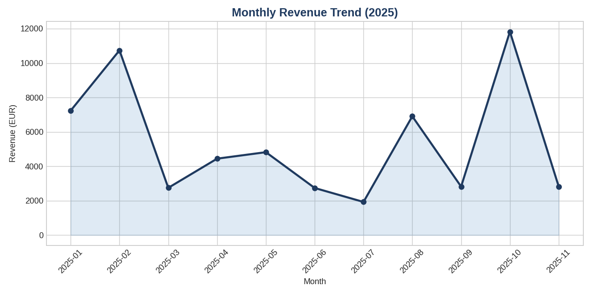
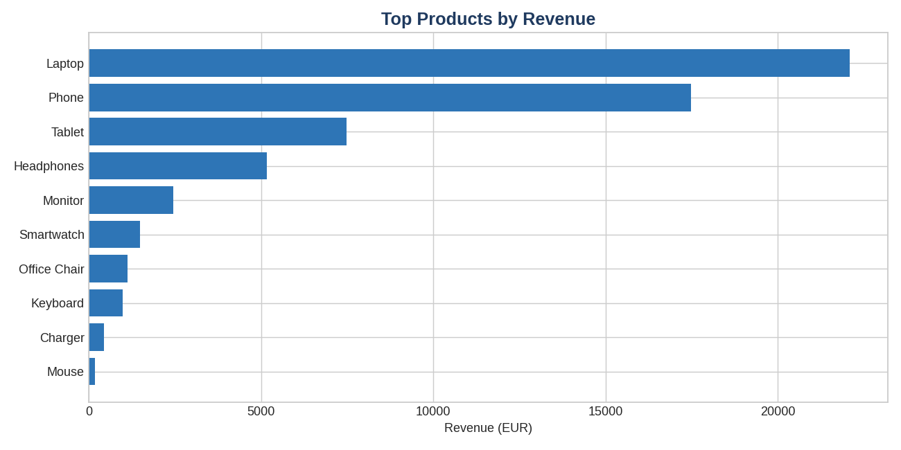
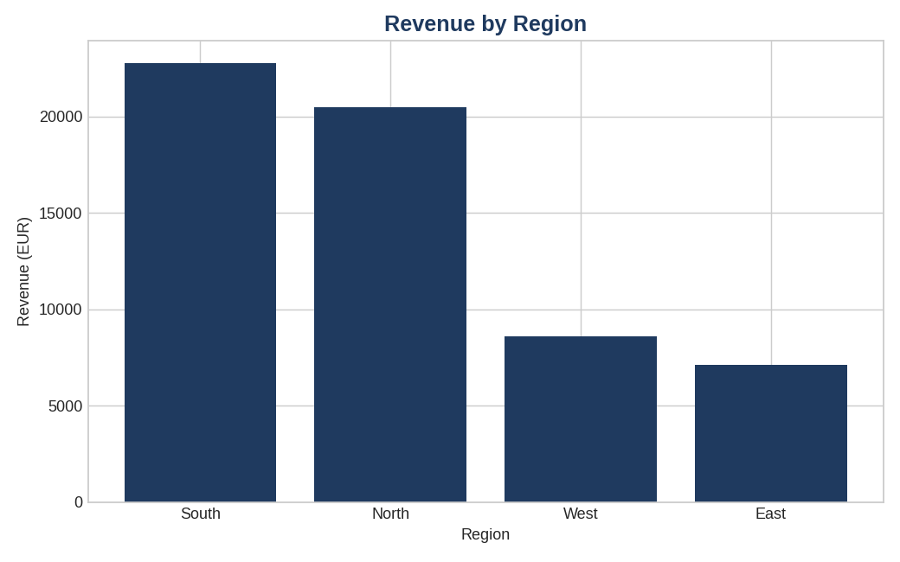
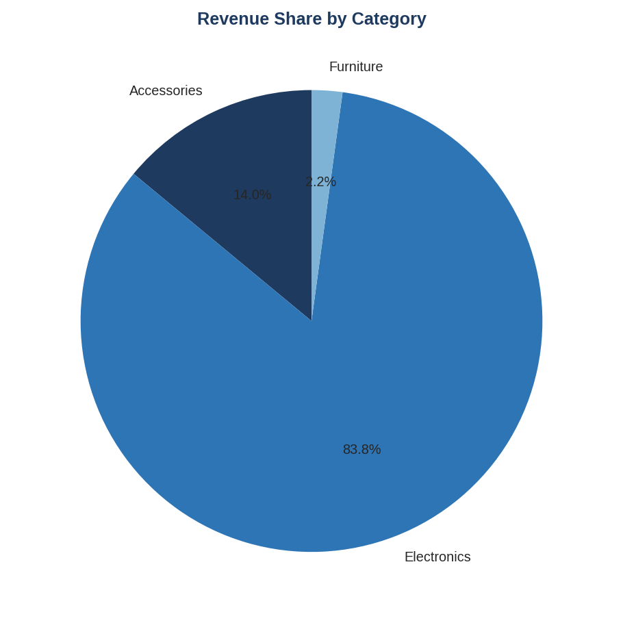

# Business Sales Analysis & Executive Reporting

> A consulting-style data analysis project for a multi-region retail client. Transforms raw transactional sales data into executive-level KPIs, visual reports, and strategic recommendations using Python, Pandas, and SQL.



---

## Project Overview

This project simulates a real client engagement: a retail company with declining growth needs visibility into product, regional, and customer performance. As the data analyst / consultant, I gathered business requirements, built a reproducible analysis pipeline in Python, validated findings with SQL, and produced an executive-level reporting package.

**Role:** Data Analyst / Consultant (solo project)
**Stack:** Python · Pandas · matplotlib · SQL
**Deliverables:** Analysis pipeline, KPI report, executive charts, business insights, executive summary

---

## Business Context

| Item | Detail |
|------|--------|
| Client profile | Multi-region retail company, online + in-store |
| Core business challenge | Declining revenue growth, low customer retention, unclear category performance |
| Project goals | Identify revenue trends, surface high-value customers, optimize product mix |

Full requirements: [`business-requirements.md`](./business-requirements.md)

---

## Headline KPIs

Generated from the included sample dataset (100 transactions, Jan–Nov 2025):

| KPI | Value |
|-----|-------|
| Total revenue | **€59,026** |
| Total orders | 100 |
| Unique customers | 20 |
| Average order value | €590.26 |
| Top product | **Laptop** |
| Top region | **South** |
| Top category | **Electronics** |

Machine-readable copy: [`output/kpi_report.json`](./output/kpi_report.json)

---

## Executive Charts

### Top Products by Revenue


### Revenue by Region


### Revenue Share by Category


---

## Key Business Insights

- **Electronics dominates revenue** at ~84% of total — Phones and Laptops are the core revenue drivers.
- **Strong regional concentration** — the top two regions account for the majority of revenue, indicating both a strength to scale and a concentration risk.
- **Repeat buyers exist but are underleveraged** — customer C001 and a small cohort of high-value customers drive disproportionate revenue, signaling a clear retention opportunity.

Full analysis: [`insights.md`](./insights.md) · Strategic recommendations: [`executive-report.md`](./executive-report.md)

---

## Repository Structure

```
.
├── README.md                      # This file
├── analysis.py                    # Main Python analysis pipeline
├── analysis.sql                   # Equivalent analytical queries in SQL
├── requirements.txt               # Python dependencies
├── data/
│   └── sales_data.csv             # Sample transactional dataset (100 rows)
├── output/                        # Generated outputs (committed for review)
│   ├── kpi_report.json
│   ├── monthly_revenue.png
│   ├── top_products.png
│   ├── revenue_by_region.png
│   └── category_breakdown.png
├── business-requirements.md       # Client business challenges & goals
├── data-model.md                  # Core entities and KPIs
├── insights.md                    # Findings & recommendations
└── executive-report.md            # Executive consulting summary
```

---

## How to Run

```bash
pip install -r requirements.txt
python analysis.py
```

The script:
1. Loads and validates the CSV dataset
2. Computes business KPIs
3. Generates four executive charts as PNGs in `output/`
4. Writes a machine-readable `kpi_report.json`

Sample console output:

```
============================================================
 SALES ANALYSIS — Executive Reporting Pipeline
============================================================
Loaded 100 transactions (2025-01-02 → 2025-11-27)

Headline KPIs:
  total_revenue_eur         59026.0
  total_orders              100
  unique_customers          20
  avg_order_value           590.26
  top_product               Laptop
  top_region                South
  top_category              Electronics
```

---

## SQL Companion

`analysis.sql` re-implements the same business questions in SQL — top products, regional revenue, monthly trend, category share, customer lifetime value, and repeat-buyer rate. Demonstrates relational thinking alongside the Pandas implementation.

---

## Skills Demonstrated

**Programming:** Python, Pandas, matplotlib, SQL
**Data:** Data ingestion, cleaning, aggregation, KPI design, visualization
**Analytical thinking:** Translating business questions into queries and charts
**Consulting:** Requirements gathering, executive reporting, insight communication
**Software practices:** Modular code, reproducible pipelines, dependency management, version control

---

## Author

**Kumail Janjua** 
